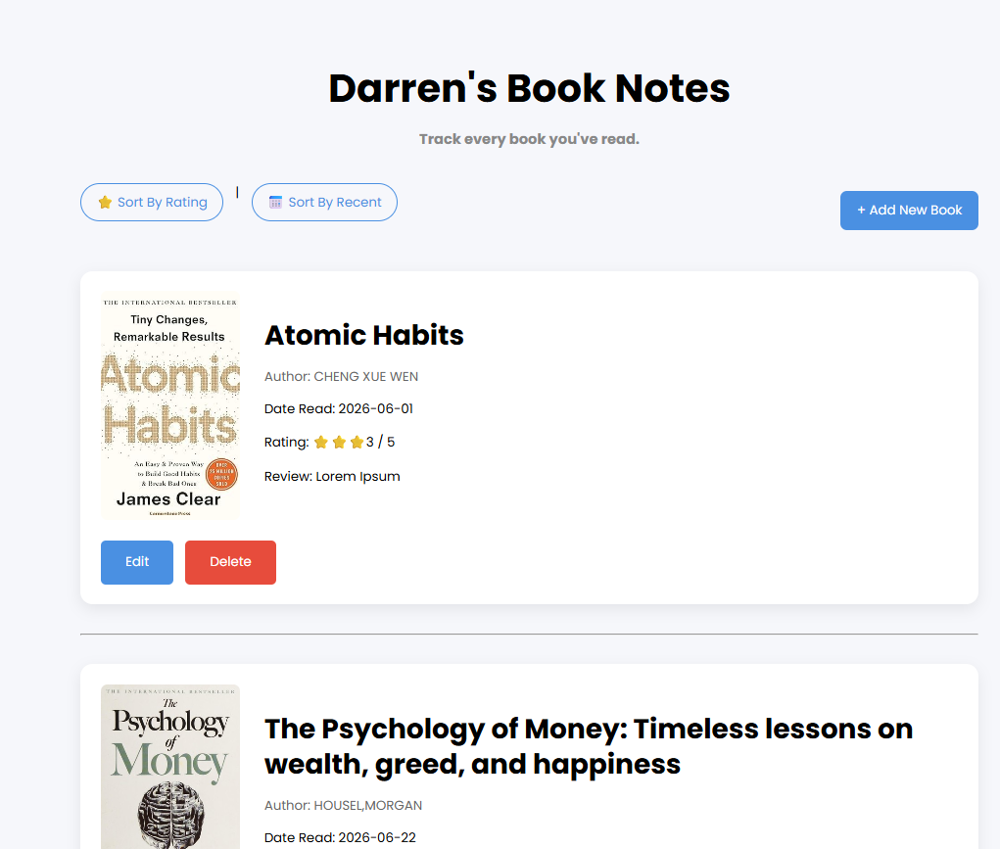
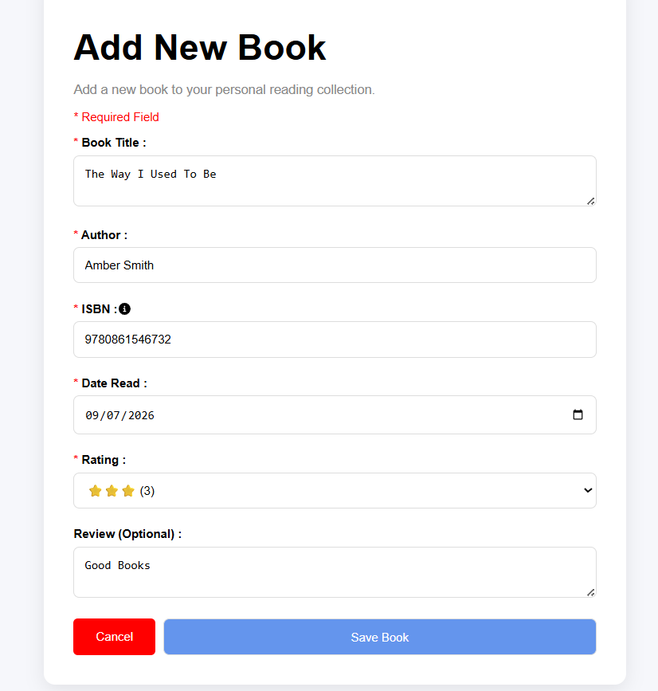
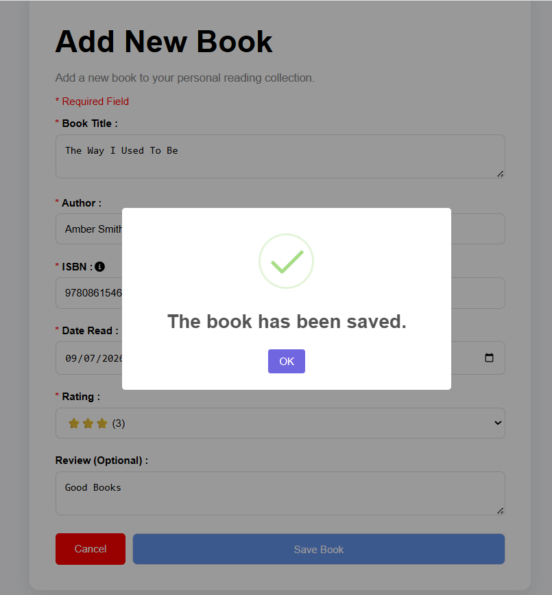
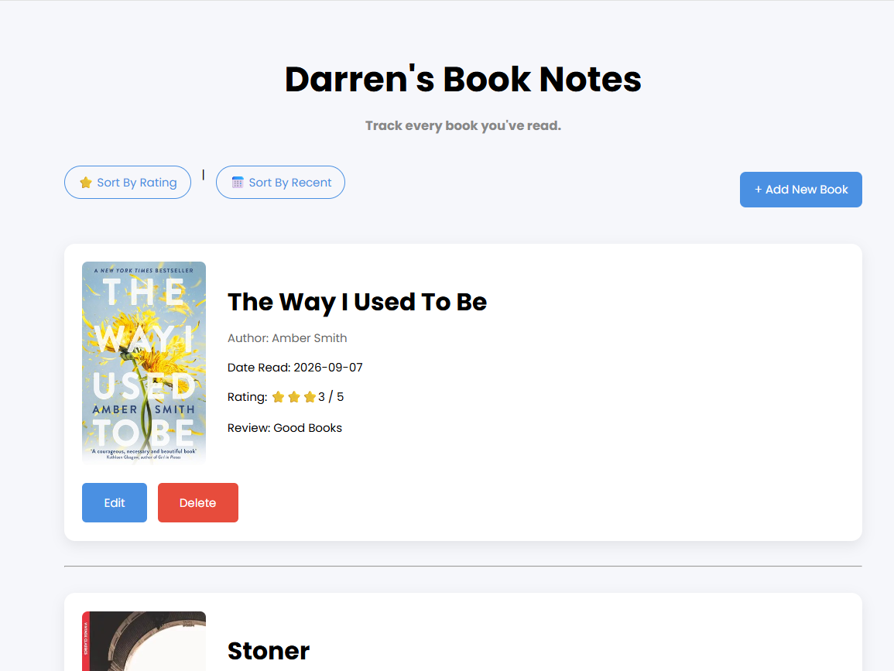
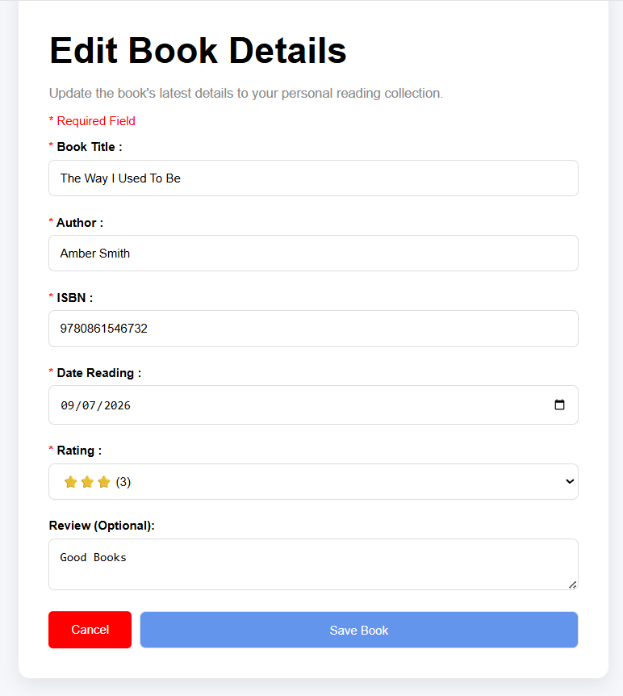
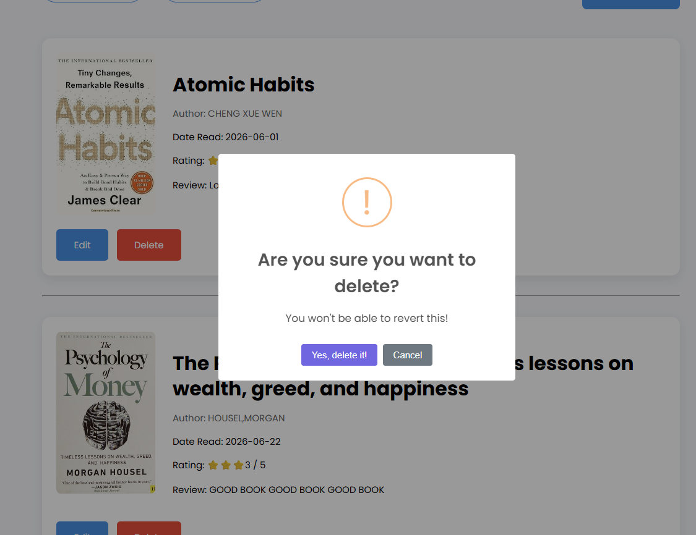
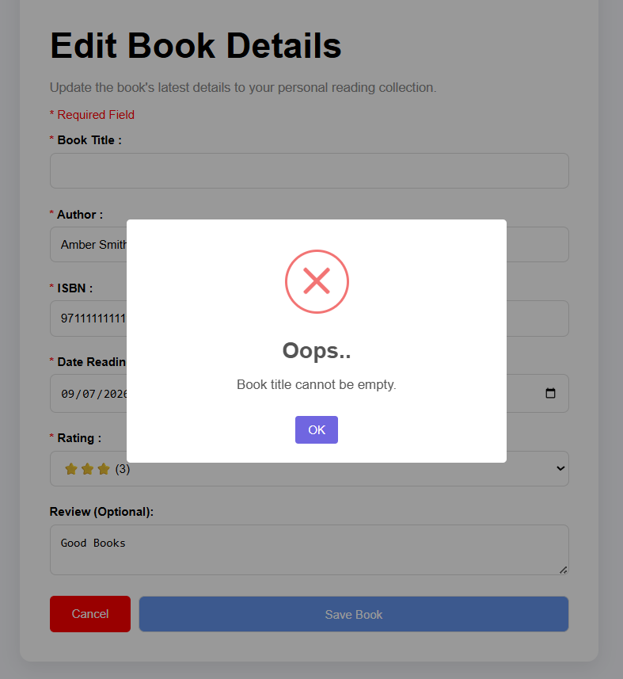
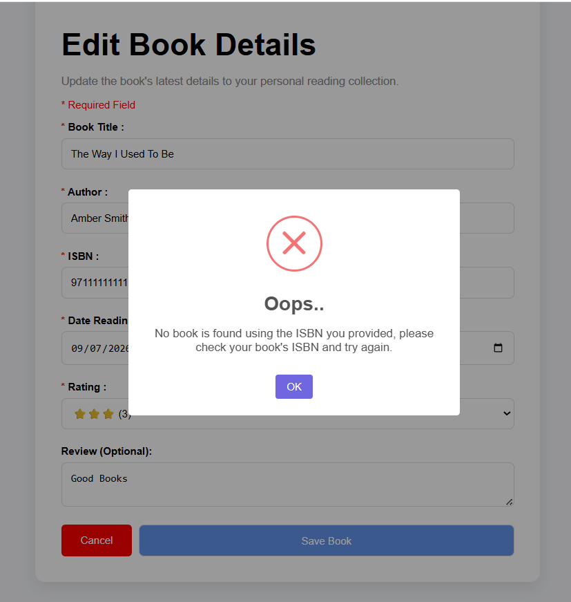

# Book-Notes-Project
The Book Note Capstone Project. 

A full-stack web application for managing and reviewing books that I have read.

This project was developed as a Capstone Project. It allows users to keep track of their books, write personal reviews, rate books, and automatically retrieve book cover images using the Open Library API.

## ✨ Features
- Add a new book
- Edit existing book information
- Delete books
- Add personal reviews and ratings
- Record the date a book was read
- Display book cover images using the Open Library Covers API
- Sort books by rating
- Sort books by reading date
- Form validation and error handling
- Responsive and user-friendly interface

## 📸 Screenshots

### Homepage



### Add Book





### Edit Book



### Delete Book



### Form Validation (User Error Handling)



### API Error Handling




### 🛠️ Technologies Used

### Frontend
- EJS
- HTML5
- CSS
- jQuery
- SweetAlert 2

### Backend
- Node.js
- Express.js

### Database
- PostgreSQL

### APIs
- Open Library Covers API
The Open Library Covers API is used to display book cover images. Book covers are loaded directly from Open Library rather than being downloaded and stored locally.


## Installation

### Prerequisites
- Node.js v16+
- PostgreSQL (pgAdmin 4)
- A modern web browser

### Set-Up Steps
1. Clone the repository
```
git clone https://github.com/darrencheng97/Book-Notes-Project.git
cd book-note-project
```

2. Install dependencies:
```
npm install
```

3. Create the database and tables:
```sql
/* Create the database */
CREATE DATABASE book-notes;

/* Create the books table */
CREATE TABLE books (
  id SERIAL PRIMARY KEY,
  title VARCHAR(255) NOT NULL,
  author VARCHAR(255) NOT NULL,
  isbn VARCHAR(20),
  read_date DATE,
  rating INT,
  review TEXT
);
```

4. Set up the PosgreSQL database connection in the ```index.js``` file
```
const db = new pg.Client({
    user: <your_db_user>,
    host: "localhost",
    database: "book-notes",
    password: <your_db_password>,
    port: 5432,
});
```

5. Start the server:
```
node index.js
```
Or, if your're using Nodemon:
```
nodemon index.js
```

6. The application will run at:
```
https://localhost:3000
```

### Project Structure
```
book-note-project/
│
├── public/
│   ├── css/
│   ├── js/
│   └── images/
│
├── views/
│   ├── index.ejs
│   ├── add.ejs
│   └── edit.ejs
│
├── index.js
├── package.json
├── package-lock.json
├── .gitignore
└── README.md
```

### 🎯 Learning Objectives

Through this project, I gained practical experience in:
- Building a full-stack web application
- Creating RESTful routes with Express.js
- Performing CRUD operations with PostgreSQL
- Using EJS for server-side rendering
- Integrating third-party APIs
- Working with asynchronous JavaScript and Axios
- Handling API errors
- Implementing form validation
- Designing responsive user interfaces with CSS
- Managing source code using Git and GitHub
